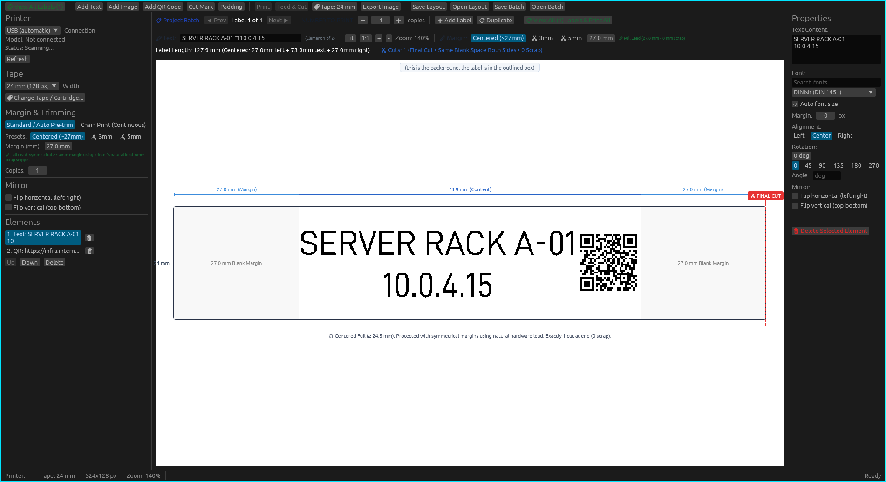

# ptouch-rs-notstupid

> [!IMPORTANT]
> **Hardware & Platform Target Notice:**
> Everything changed, patched, and developed in this repository was **tested exclusively on the Brother P-touch PT-D600 under Linux**. We do not test or guarantee behavior on other printer models or non-Linux operating systems.

Rust tool for Brother P-Touch USB label printers. CLI and GUI.
Optional native macOS Bluetooth support is available in `ptouch-core` for the PT-P300BT.

Using a **PT-D600 on Linux**? See the [setup guide](docs/pt-d600-linux.md)
for USB permissions, WSL notes, an editable example and the reliability fixes
in [ptouch-rs-notstupid](https://github.com/wakuwakumiwaku/ptouch-rs-notstupid) (originally forked from [vowstar/ptouch-rs](https://github.com/vowstar/ptouch-rs)).



<p align="center">
  <em>ptouch-gui preview: clean white canvas, outlined label tape, symmetrical centered margins, and precise millimeter cut indicators</em>
</p>

<details>
<summary><strong>📸 First-Run Setup & Cartridge Tracking Modal</strong> (click to expand)</summary>
<br>


</details>

## Features

- **Native QR Code Generation**: Pure-Rust 1-bit QR code engine with crisp integer module scaling ($M \ge 1$ px/module) and quiet zones for razor-sharp thermal printhead edges. Reliably readable by smartphones and 2D barcode scanners with zero subpixel fuzziness. Features inline quick editing, 0°–270° rotation, height presets, and 1-click formats (URLs, Wi-Fi `WIFI:S:...`, and Asset Tags).
- **Multi-Label Batch Projects**: Manage multiple labels in a single project with live visual tape previews, in-place card editing, and an explicit **NUMBER TO PRINT** copy counter directly beside each label.
- **Continuous Zero-Waste Batch Printing**: Print an entire queue of different labels in one continuous chain session (`chain = true`), cutting tape waste between labels down to 0 mm. Includes per-label auto-cut toggles in the batch overview.
- **Smart Automatic Pre-Trimming & Mixed Batches**: Automatically detects when label content extends into the prehead blank area and enables pre-trimming without manual configuration. Mixed batches seamlessly combine standard zero-waste chain labels and pre-trimmed labels in a single job.
- **Fast Batch Navigation & Editing**: Jump between labels in the designer canvas using `←` / `→` keyboard arrow shortcuts. Double-click any label on the canvas or batch overview card to immediately focus the text editor.
- **Hardware Connection Safety & Emergency Cancellation**: The canvas and controls are safely locked and dimmed out until a physical printer is connected and powered on. Includes live status monitoring and an immediate **Cancel Print** button to abort jobs cleanly.
- **Quick Batch Generation**: Instant creation of series tags (sequential numbering `Server-01` to `Server-24` with zero-padding) or line-by-line text lists.
- **Bundled Professional Typography**: Embedded **Inter** (modern ultra-legible default), **DIN 1451 / DINish** (German industrial engineering standard), and **Frutiger** (maximum distance recognition).
- Print text labels with custom font, size, alignment and rotation
- Print images (PNG, JPEG, GIF, BMP, TIFF, WebP, SVG, and more)
- Compose multi-element labels (text + QR code + image + cut mark + padding)
- Save and reload designs as self-contained `.ptl` (single label) or `.ptb` (multi-label batch) layout files with embedded images
- Template layouts with `{{name}}` placeholders and batch-print from a CSV
- Chain print and multi-copy support
- Print quality modes on 360 dpi models (high resolution 360x720, draft 360x180)
- GUI with live preview, zoom, and drag-and-drop element reordering
- Export to image (PNG, JPEG, BMP, GIF, TIFF, WebP) without a printer connected
- Feed and cut tape without printing

## Hardware Safety & On-Board Memory FAQ

| Question | Answer & Technical Detail |
| :--- | :--- |
| **Can transferring layouts to printer flash brick or damage the device?** | **No.** Brother printers with on-board memory (like the PT-D600) have a dedicated user storage partition that is physically and logically isolated from the bootloader and firmware ROM. |
| **How can I recover if a transferred template is corrupt or freezes?** | Brother printers provide a physical hardware reset: holding **Shift + R** (or **Shift + Backspace**) while powering on, or selecting *Menu $\rightarrow$ Reset $\rightarrow$ Transfer Data Reset*, wipes all user templates back to factory default in seconds. |
| **Does direct USB printing wear out flash memory?** | **No.** Direct printing uses 100% volatile RAM (`ESC i a 01h` raster mode). Zero writes are made to permanent flash memory, ensuring unlimited print cycles with zero wear. |
| **Which printer models support saving templates to memory?** | Models equipped with user memory and physical screens/keyboards (e.g. PT-D600, PT-E550W, PT-P900W). Raster-only models (e.g. PT-P300BT Cube, PT-D210) do not have flash storage and print strictly via direct USB/Bluetooth raster. |
| **How does software protect the printer during communication?** | The software queries USB device status and capability descriptors before issuing commands, validates all payload lengths and checksums in memory, and never writes in uncontrolled loops. |

## Supported Printers

PT-9200DX, PT-2300, PT-2420PC, PT-9500PC, PT-9700PC, PT-2450PC, PT-18R,
PT-1950, PT-2700, PT-1230PC, PT-2430PC, PT-2730, PT-H500, PT-E500, PT-E550W,
PT-P700, PT-P750W, PT-D410, PT-D450, PT-D460BT, PT-D600, PT-D610BT,
PT-P710BT, PT-E310BT, PT-E560BT and more.

Tape widths: 3.5mm, 6mm, 9mm, 12mm, 18mm, 24mm, 36mm.

## Building

Requires Rust stable toolchain.

**Linux** (libusb + udev):

```sh
sudo apt install libusb-1.0-0-dev libudev-dev   # Debian/Ubuntu
sudo pacman -S libusb                            # Arch
sudo emerge dev-libs/libusb                      # Gentoo
cargo build --release --workspace
```

**macOS / Windows**: no extra dependencies.

```sh
cargo build --release --workspace
```

Binaries: `target/release/ptouch` (CLI), `target/release/ptouch-gui` (GUI).

libusb is compiled in statically (`rusb` vendored), so the binaries carry no
external libusb dependency.

**Nix** (flake at the repository root):

```sh
nix build          # ptouch-gui; `nix run .#ptouch` runs the CLI
nix develop        # dev shell
nix flake check    # cargo fmt, clippy and the workspace tests
```

## PT-P300BT Bluetooth (macOS)

The macOS CLI can use the native RFCOMM backend for an already-paired PT-P300BT.
Pair the printer in macOS Bluetooth settings and grant Bluetooth access to the
terminal. Without `--bluetooth`, the CLI continues to select USB printers.

```sh
CARGO_HOME=/tmp/ptouch-bt-cargo cargo run -p ptouch-cli -- bluetooth-list
CARGO_HOME=/tmp/ptouch-bt-cargo cargo run -p ptouch-cli -- info --bluetooth AA:BB:CC:DD:EE:FF
CARGO_HOME=/tmp/ptouch-bt-cargo cargo run -p ptouch-cli -- print --bluetooth AA:BB:CC:DD:EE:FF "Hello"
```

Replace the address with your paired printer's address. Text, images, saved
layouts, CSV batches, and multiple copies use the normal CLI rendering flow.
PT-P300BT rejects `--chain`, `--precut`, and non-standard quality modes before
connecting. Cargo artifacts stay in the checkout and dependencies in the
specified temporary cache. No Python packages or Bluetooth serial device nodes
are required.

The first profile supports the physically verified 12mm tape, with 64 printable
dots centered in 128-dot raster transfer lines at 180 dpi. Other widths and marks
outside that area are rejected. Printing waits for the printer's completion
notification, checks errors, and never automatically retries a failed job.
The PT-P300BT has a manual cutter.

The GUI on macOS also lists paired PT-P300BT printers in its **Connection**
selector. Select the printer and click **Refresh** to query its tape, then compose
and print through the normal preview workflow. Bluetooth operations run outside
the interface process so connecting and printing do not block window updates.

Library users can also open `ptouch_core::BluetoothDevice`, call `init`, prepare
16-byte raster lines using bottom-to-top dot order, then call `print_raster` and
`close`. Native objects stay on the main thread and cannot be sent or shared
across threads. These synchronous session calls are suitable for the example;
the GUI needs a separate event-driven service before Bluetooth selection is
added. Close assumes exclusive ownership and also disconnects the printer's
baseband connection. Apple's baseband close is synchronous. If an async write
never completes, one transfer buffer is conservatively retained to avoid freeing
memory still potentially used by Bluetooth; this only occurs on a failed
connection, which is then closed.

## Prebuilt Packages

Each release publishes ready-to-use downloads on the
[releases page](https://github.com/vowstar/ptouch-rs/releases):

- **Linux**: `.deb` and `.rpm` that install the CLI, the GUI, the desktop entry,
  the icon, and the udev rule (the post-install step reloads udev), plus the raw
  binaries.
- **macOS**: `ptouch-gui-macos-arm64.app.zip` (a `.app` bundle with the icon)
  and the raw `ptouch` CLI binary. The app is unsigned, so on first launch
  right-click the app and choose Open, or run
  `xattr -dr com.apple.quarantine ptouch-gui.app`.
- **Windows**: `ptouch.exe` and `ptouch-gui.exe` (the icon is embedded).

## GUI

```sh
ptouch-gui
```

- Live label preview with zoom, millimeter rulers, tape outline, and cut indicators
- Native QR Code generator with 1-click presets (URL, Wi-Fi, Asset Tag) and integer-module thermal scaling
- Add/edit/reorder text, QR codes, images, cut marks, padding
- Fast batch navigation via `←` / `→` arrow keys on canvas
- Double-click canvas or batch cards to edit text immediately
- Automatic pre-trimming detection & mixed regular/pretrimmed batch printing
- Batch Overview with live multi-label cards, in-place editing, and per-label auto-cut toggles
- Category 3 hardware safety protection: canvas and controls blackout when disconnected
- Real-time printer status monitoring and emergency print cancellation (`Cancel Print`)
- Free-angle text and QR rotation with auto font sizing
- Mirror the whole label or a single element (horizontal/vertical)
- Tape width selection and startup cartridge tracking modal
- Save/Open layout (`.ptl`) or multi-label batch project (`.ptb`) with embedded assets
- Print to connected printer or export to image file
- Feed and cut tape without printing

## CLI Usage

```sh
# Print text
ptouch print "Hello World"

# Multi-line text
ptouch print "Line 1" "Line 2"

# Print with options
ptouch print "Label" -f "DejaVu Sans" -s 32 -a center

# Print QR code (URL or text)
ptouch print -q "https://github.com/wakuwakumiwaku/ptouch-rs-notstupid"

# Combined text + QR code
ptouch print "Server Rack" -q "https://inventory.local/rack-01"

# Print image (PNG, JPEG, BMP, SVG, etc.)
ptouch print -i logo.png

# Text + image + cut mark
ptouch print "Name" -i photo.png -c

# Mirror the whole label left-right (e.g. clear tape read from the back)
ptouch print "MIRROR" --flip-h

# Export to image file (no printer needed, format from extension)
ptouch print "Preview" -o label.png -w 76
ptouch print "Preview" -o label.bmp -w 76
ptouch print -q "https://example.com" -o qr-label.png -w 76

# Print a layout designed in the GUI (images are embedded in the file)
ptouch print --layout label.ptl

# Render a layout to an image without a printer (uses the saved tape width)
ptouch print --layout label.ptl -o label.png

# Show printer info
ptouch info

# List supported models
ptouch list
```

### Layout templates and batch printing

Text in a layout may contain `{{name}}` placeholders. Fill them per print, or
drive a batch from a CSV file.

```sh
# See which placeholders a layout declares
ptouch print --layout badge.ptl --list-vars

# Fill placeholders for a single label
ptouch print --layout badge.ptl --set name=Alice --set id=A001

# One label per CSV row; the header row names the placeholders
ptouch print --layout badge.ptl --csv people.csv

# Batch to image files instead of a printer ({n} is the row number)
ptouch print --layout badge.ptl --csv people.csv -o 'badge-{n}.png'

# CSV from stdin, with a constant value applied to every row
cat people.csv | ptouch print --layout badge.ptl --csv - --set dept=Eng
```

### Print options

| Flag | Long | Description |
|------|------|-------------|
| | `TEXT...` | Text lines (max 4) |
| `-l` | `--layout` | Print a saved layout file (.ptl); overrides content flags |
| | `--set` | Set a layout placeholder, `KEY=VALUE` (repeatable) |
| | `--csv` | Batch-print one label per CSV row (`-` for stdin) |
| | `--list-vars` | List the placeholders a layout declares, then exit |
| | `--allow-missing` | Render placeholders with no value as blank |
| `-i` | `--image` | Image file path |
| `-q` | `--qr` | Print a QR code (URL or text) |
| `-o` | `--output` | Export to image file instead of printing |
| `-f` | `--font` | Font name (default: Inter, bundled: Inter, DINish/DIN 1451, Frutiger) |
| `-s` | `--size` | Font size in points (auto if omitted) |
| `-m` | `--margin` | Top/bottom margin in pixels |
| `-a` | `--align` | Text alignment: left, center, right |
| `-w` | `--tape-width` | Force tape width in pixels (with `-o`) |
| `-c` | `--cut` | Add cut mark |
| `-p` | `--pad` | Add padding in pixels |
| | `--flip-h` | Mirror the whole label left-right (horizontal) |
| | `--flip-v` | Mirror the whole label top-bottom (vertical) |
| | `--chain` | Skip final feed/cut (chained labels) |
| | `--precut` | Cut before the label |
| | `--binarize` | Binarization: auto, threshold, dither |
| | `--copies` | Number of copies |
| | `--timeout` | Printer timeout in seconds |
| | `--debug` | Enable debug output |

## USB Permissions (Linux)

The `.deb`/`.rpm` install and load this rule for you. To do it manually, copy
the udev rules file:

```sh
sudo cp data/udev/20-usb-ptouch-permissions.rules /etc/udev/rules.d/
sudo udevadm control --reload-rules
sudo udevadm trigger
```

## Desktop Integration (Linux)

The `.deb`/`.rpm` already install these. To do it manually, install the desktop
entry and icon so `ptouch-gui` appears in your application menu:

```sh
sudo install -Dm644 data/io.github.vowstar.ptouch-gui.desktop \
  /usr/share/applications/io.github.vowstar.ptouch-gui.desktop
sudo install -Dm644 data/io.github.vowstar.ptouch-gui.svg \
  /usr/share/icons/hicolor/scalable/apps/io.github.vowstar.ptouch-gui.svg
sudo gtk-update-icon-cache -f /usr/share/icons/hicolor 2>/dev/null || true
```

## Application Icon

`data/io.github.vowstar.ptouch-gui.svg` is the single source of truth. The
raster forms are generated from it by `scripts/gen-icons.sh` (needs
`rsvg-convert`, `magick`, and `python3`) and committed so normal builds need no
rasterizer:

- `crates/ptouch-gui/assets/icon.png` embedded as the runtime window icon
- `data/windows/ptouch-gui.ico` embedded into the `.exe` by `build.rs`
- `data/macos/ptouch-gui.icns` used by `cargo bundle` for the macOS `.app`

Regenerate after editing the SVG, then commit the result. CI checks that the
committed rasters still match the SVG.

## USB Driver (Windows)

Communication goes through libusb, which on Windows can only reach a device
that uses the WinUSB driver. Out of the box Windows binds the printer to its
own driver (and the official Brother driver does the same), so `ptouch info`
reports `Device not found` until you switch it. See issue
[#4](https://github.com/vowstar/ptouch-rs/issues/4).

1. Download [Zadig](https://zadig.akeo.ie/).
2. Plug in the printer, then choose `Options > List All Devices`.
3. Select your printer in the list (Brother VID `04F9`).
4. Pick `WinUSB` as the target driver and click `Replace Driver`.
5. Run `ptouch info` again.

After this the normal Brother software no longer sees the printer. Undo it any
time by uninstalling or rolling back the driver in Device Manager.

## USB Driver (macOS)

No driver replacement is needed. Install libusb and it works directly:

```sh
brew install libusb
```

If claiming the device fails with a busy or access error, make sure the
printer is not added as a print queue in System Settings.

## Project Structure

```
crates/
  ptouch-core/    -- USB transport, protocol, device/tape tables
  ptouch-render/  -- Bitmap, text rendering, image loading, raster
  ptouch-cli/     -- CLI binary
  ptouch-gui/     -- GUI binary (egui)
```

## Protocol References

The protocol and device layer is derived from ptouch-print (see License
below). Protocol details are additionally cross-checked against Brother's
published command references and the device behavior documented by other
open source drivers:

- [Brother PT-E550W/PT-P750W/PT-P710BT Raster Command Reference](https://download.brother.com/welcome/docp100064/cv_pte550wp750wp710bt_eng_raster_102.pdf)
- [Brother PT-H500/PT-P700/PT-E500 Raster Command Reference](https://download.brother.com/welcome/docp000771/cv_pth500p700e500_eng_raster_111.pdf)
- [Brother PT-P900/P900W/P950NW Raster Command Reference](https://download.brother.com/welcome/docp100407/cv_ptp900_eng_raster_102.pdf)
- [Brother PT-9700PC/PT-9800PCN ESC/P Command Reference](https://download.brother.com/welcome/docp000584/cv_pt9700_eng_escp_103.pdf)
- [printer-driver-ptouch](https://github.com/philpem/printer-driver-ptouch)
- [rasterprynt](https://github.com/boxine/rasterprynt)
- [pyPTouch](https://github.com/amathieson/pyPTouch)

## License

This project's printer protocol and device layer is derived from
[ptouch-print](https://git.familie-radermacher.ch/linux/ptouch-print.git) by
Dominic Radermacher and the ptouch-print contributors, which is licensed under
the GPLv3. Thanks to them for the reverse engineering that made this possible.

Because of that, the project as a whole and the distributed `ptouch` and
`ptouch-gui` binaries are licensed **GPL-3.0-or-later** (see [LICENSE](LICENSE)).

Per-directory licensing (each source file carries an SPDX header):

| Path | License | Notes |
|------|---------|-------|
| `crates/ptouch-core/` | GPL-3.0-or-later | Device table, flags, status protocol, command construction. Derived from ptouch-print. |
| `crates/ptouch-render/src/raster.rs` | GPL-3.0-or-later | Raster bit-packing. Derived from ptouch-print. |
| `crates/ptouch-render/` (other files) | MIT | Bitmap, text, image loading, composition. Original work. |
| `crates/ptouch-cli/` | MIT | Original work. |
| `crates/ptouch-gui/` | MIT | Original work. |

The MIT-licensed files are reusable on their own under the MIT license (see
[LICENSE-MIT](LICENSE-MIT)). Any program that links `ptouch-core`, including the
binaries in this repository, is covered by the GPLv3. See [NOTICE](NOTICE) for
attribution details.
